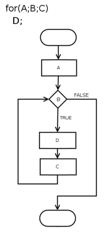
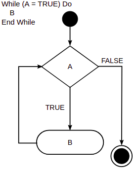

1. What is a loop in programming?
   
       In computer science, a loop is a programming structure that repeats a sequence of instructions until a specific condition is met. Programmers use loops to cycle through values, add sums of numbers, repeat functions, and many other things

       

2. What are the different loops in Python?
   1. for loop
   
      
   
            for i in range(1, 6):  # gives i values from 1 to 5 inclusive (but not 6)

                print(i)

   2. while
      

            counter = 5                           # Set the value to 5 
            sum = 0                               # Set the value to 0

            while counter > 0:                    # While counter(5) is greater than 0  
               sum += sum                        # Set new value of sum to counter.
               counter -= 1                      # Set the counter to counter - 1.

            print(sum)                      # Print the value of factorial.

 